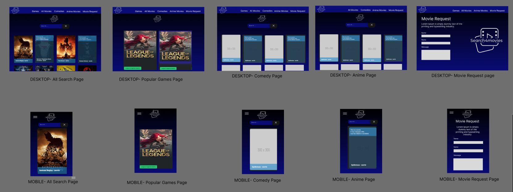
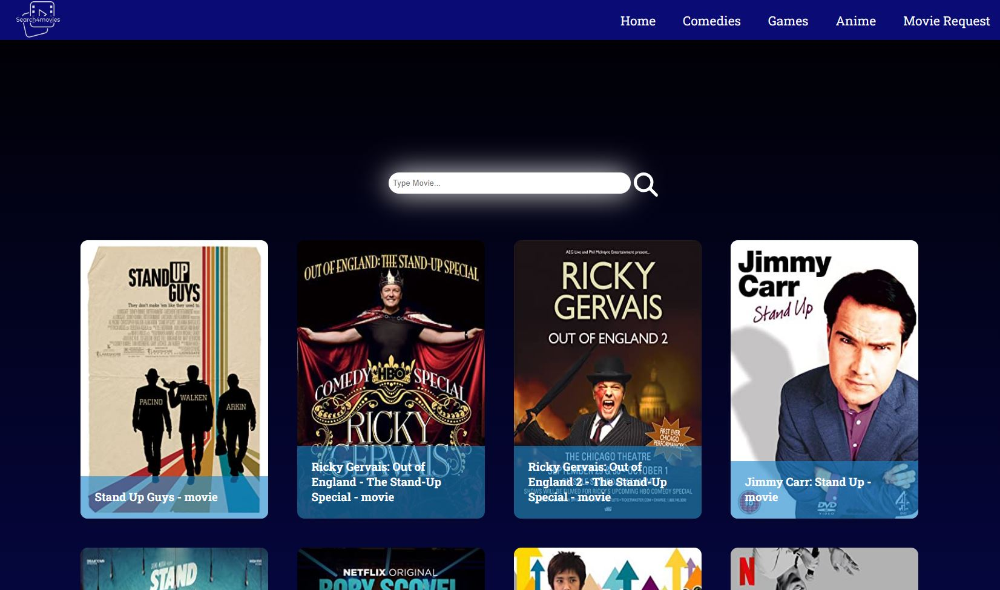
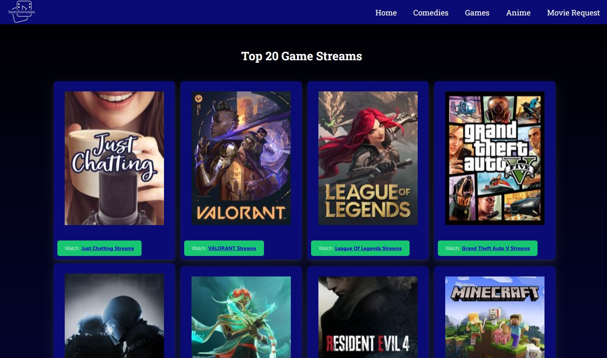
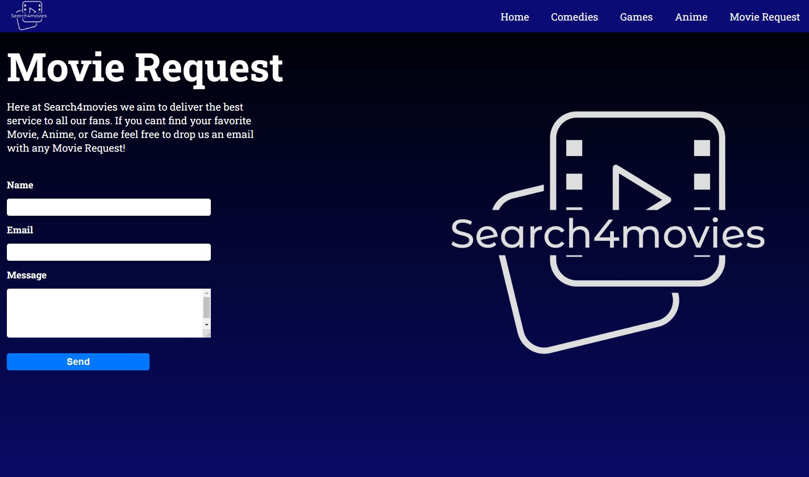

# Client-Side Application Project

Our motivation for this project was to conceive and execute a design that solves a real-world problem, thus creating a client-side application. 

We quickly decided to go with a common interest among the group, after a discussion we decided to go for a Movie Search Page. As users ourselves to similar platforms, we soon realised that when visiting these pages we expect  to interact with a streamline page which is easy to navigate around. 

With wanting to solve a real-world problem that users may experience, we wanted to create a service which allows a users to search and watch a Movie, Comedies, Anime or to search and play a Video Game all under one roof with relative ease.

This project has taught us all the importance of being able to work in a team under the agile methodology. We effectively stored our project code in GitHub, managed our workloads using Trello management tool, and implemented features and bug fixes using Git branch workflow and pull requests. Once the project was completed we used Vercel to deploy the site. We are pleasured with the out come of the application and hopes it serves its purpose to not only designed users but anyone who may can want to use the service.

## Application Features

### Mark

As part of this prject, to have a pages which would display movies and basic facts of the movies we would need to pull the information from the OMDB API. To do this you require to register with OMDB for the API key (fbdf1d80) which would simply be pasted at the end of the OMDB URL(http://www.omdbapi.com/?apikey).
You would then make use of the useEffect & useState hooks within React to create the Omdb function to pull the information from OMDB website depending on the users search/imput fields and place them into the empty array within the useEffect function.
Once the data has been received you then use the return field to start to place the data on the website and using the MovieCard created by Yusuf, we would then display the requested data into movie cards.
To help make the search a bit more interactive and user friendly, we can use onKeyDown to return data while the user was typing their search, this has some area of improvement.

##### Twitch API & webpage
To create the Twitch API which is the Games Page(Live Game Streams) you would use axios dependency where you would store the client ID you will generate from Twitch developers website as well as the Authorization (Oauth / access token) which was generated using https://stevesie.com/cloud/ which would then be exported and imported in the games componenent / page.
Again, this will reuqire the useEffect & useState hooks.
Similar to the OMDB API, you would create the function to request the top 20 game streams data fom the Twitch API to be stored into an array ready to fetch the data to be displayed. You then create a newURL variable to amend display of the received artwork before returning the data to be displayed.
As this project required us to try and use additional libraries or UI's, this time we decided not to use the GamsCard created by yusuf, instead I decided to use the Shards-UI dependency which is Bootstrap theme which worked perfectly initially.
However, as the project came together with all my project team mates, I discovered that this needed to be planned out ahead of time as CSS descriptions would cause difficulties. This has caused us to have to over run some of the Shards-ui theme within the Games CSS to get this to work in time for presentation.

### Marlena

Within this project my contribution was: Figma Design, Anime Page, Movie Request Page, Email request functionality, Search Bar, README in Github and the CSS applied across the site.

The Anime Page is replicated from the Home page, I applied changes to the searchMovies function so that the page automatically loads on Anime selections. 

The Movie Request page email form was created using EmailJS, I decided to use EmailJS for its streamline approach which is as follows. EmailJS sends the emails using client-side technologies. I choose to use EmailJS as no server is required, I just had to connect EmailJS to a supported email services and create the email templates. As React is supported as one of its SDK libraries the email sent from the user is easily triggered. To make the EmailJS run correctly npm i @emailjs/browser will need to be applied in the terminal.

I wanted the design of the page to have a polished front end/UI in mind. I opted for black to blue CCS gradient design for the background. This was to add a relaxing ambience before selecting the chosen Movie/Game. In my Figma design I wanted white as a secondary colour to bring focus to the hierarchy design aspects of the pages i.e Search4movies logo in NavBar, NavBar Headers, Page Headers and the Search Bar. For extra aesthetics I applied a opacity effect onto the SearchBar, I done this to make it user-friendly and stand out on the page. The cards have a hover effect on them and give the user a movie description without having to click on the card itself. The logo was designed specifically for the use of this page. I wanted a logo that was clear and described the use of the page. I think the lettering and movie reel do this effectively. I have made the page responsive through-out so that it can serve users on the go, more importantly for users using any device they choose, i.e Mobile, Tablet/iPad, Laptop and Desktop.

### Ric

I created the navbar by making a component and then styling it via the navbar stylesheet. I added functionality by changing the state of the component with a handleClick function. It is also mobile responsive.

### Yusuf

I was responsible for creating the MovieCard.jsx file which was used to populate the movies and shows page with the use of the OMDb API. I also worked on the App.js page which was used to route the separate pages together.

## Softwars/Packages Used

- VScode
- React
- Navigation with `React Router`
- JavaScript
- CSS
- Bootstrap
- HTML
- Awesome Font 
- Git hub pages
- EmailJs
- Figma
- API's: OMDB, Twitch, NPM, Axios and Shard-UI

## Screenshot

Below are screenshots of concept designs as well as from the live page. 

### Figma concept

### Home Page 

### Comedies Page

### Games Page

### Anime Page

### Movie Request

## Links

https://github.com/markruth2nd/movies-page 

https://movies-page-5kczdqvct-markruth2nd.vercel.app/ 

## Credits

##### Mark: https://github.com/markruth2nd

##### Marlena: https://github.com/MarlenaDowner

##### Ric: https://github.com/ricJ14 

##### Yusuf: https://github.com/YusufMbk 

## License

MIT License

Copyright (c) 2022 MIT License.

Permission is hereby granted, free of charge, to any person obtaining a copy of this software and associated documentation files (the "Software"), to deal in the Software without restriction, including without limitation the rights to use, copy, modify, merge, publish, distribute, sublicense, and/or sell copies of the Software, and to permit persons to whom the Software is furnished to do so, subject to the following conditions:

The above copyright notice and this permission notice shall be included in all copies or substantial portions of the Software.

THE SOFTWARE IS PROVIDED "AS IS", WITHOUT WARRANTY OF ANY KIND, EXPRESS OR IMPLIED, INCLUDING BUT NOT LIMITED TO THE WARRANTIES OF MERCHANTABILITY, FITNESS FOR A PARTICULAR PURPOSE AND NONINFRINGEMENT. IN NO EVENT SHALL THE AUTHORS OR COPYRIGHT HOLDERS BE LIABLE FOR ANY CLAIM, DAMAGES OR OTHER LIABILITY, WHETHER IN AN ACTION OF CONTRACT, TORT OR OTHERWISE, ARISING FROM, OUT OF OR IN CONNECTION WITH THE SOFTWARE OR THE USE OR OTHER DEALINGS IN THE SOFTWARE.
